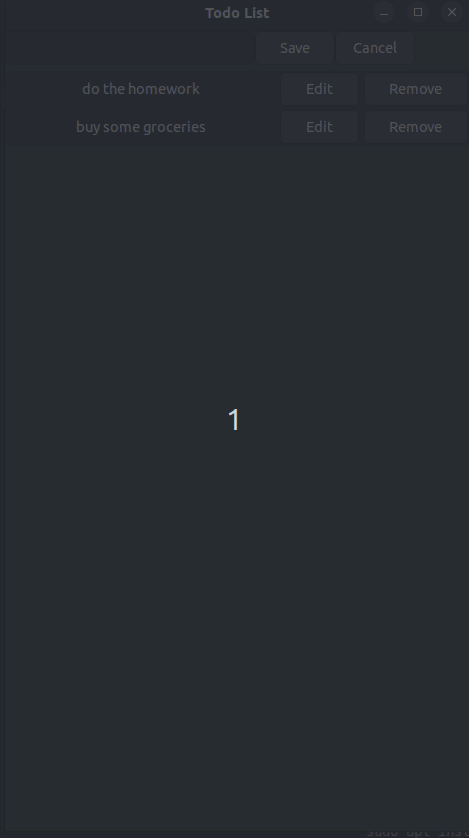

# GCC + GTK3 Sample

This is a simple Todo list made with C (with GCC compiler) and GTK3 in order to do some first steps with this technology.



## Requirements

A linux machine with `gcc g++ build-essential make camake libgtk-3-dev` installed.

## Compiling

```
mkdir build
cd build
cmake ../
make
```

